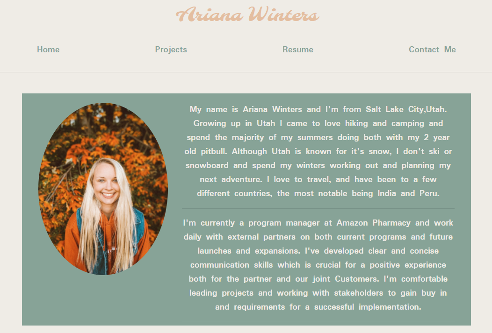
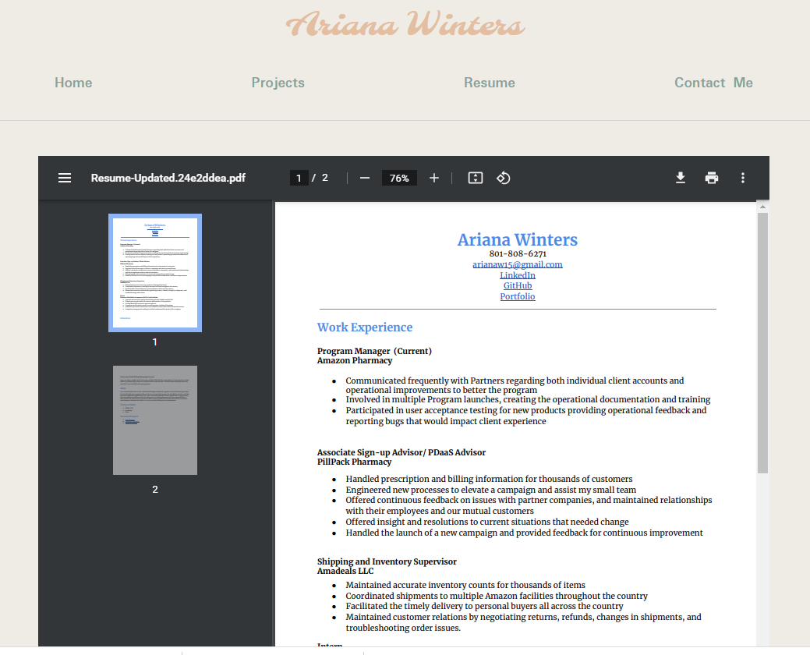
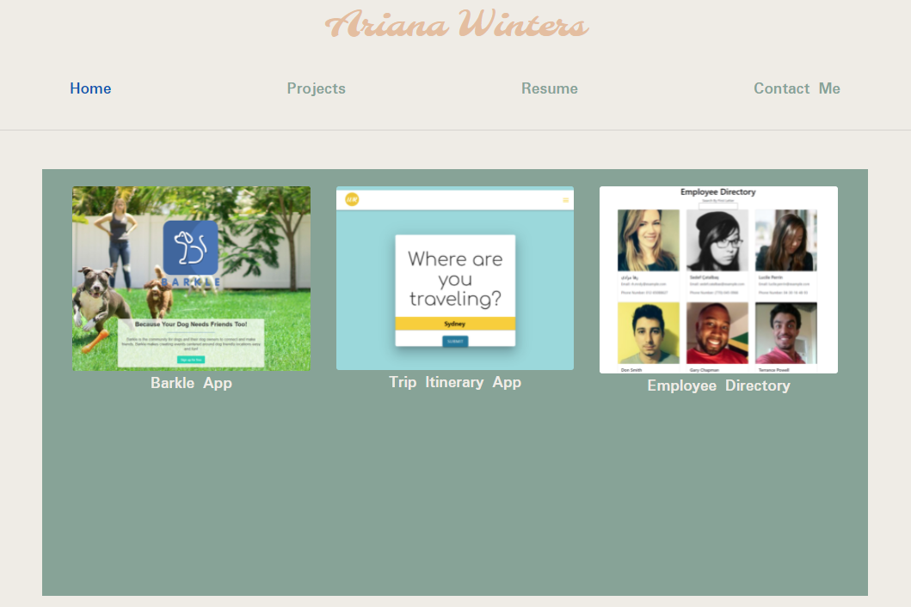
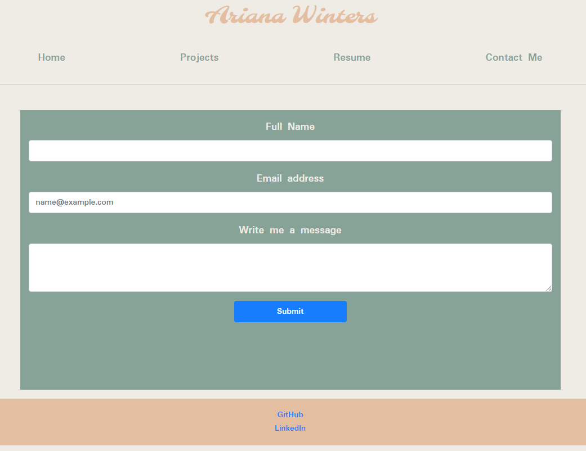

# React Portfolio

The portfolio allows the user to view my resume, important projects, and links them to my github and linkedin. It allows me to display my new skills learned since the last portfolio submission. 

# Features

The portfolio uses a react framework to allow for simple navigation between pages and clean code. 

# Images

About Me Page

Resume Page

Project Page

Contact Page

# Links

- Repository: https://github.com/arianaw15/React-Portfolio
- Portfolio Homepage: https://ariana-react-portfolio.herokuapp.com/
- LinkedIn: https://www.linkedin.com/in/ariana-winters-63455215b/
